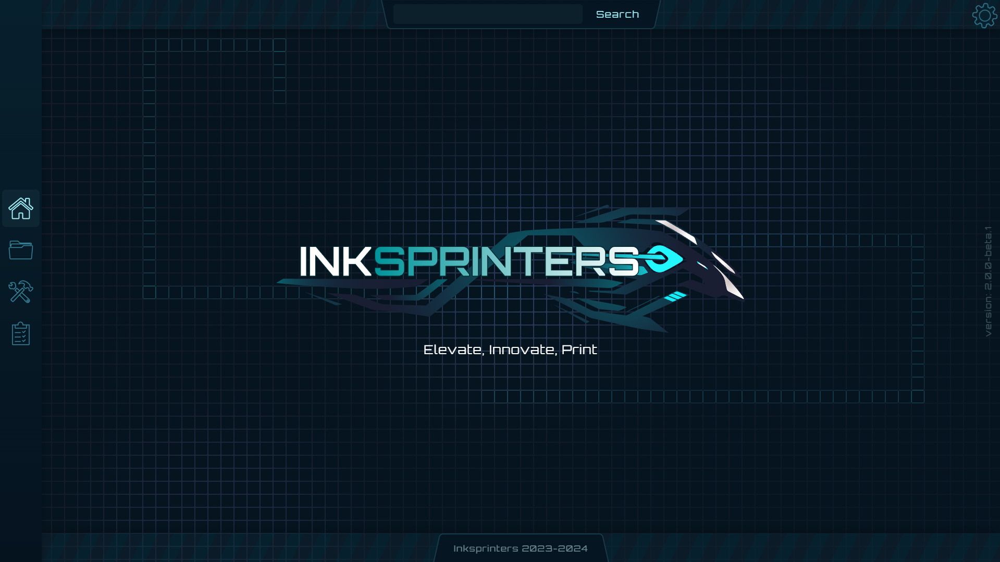
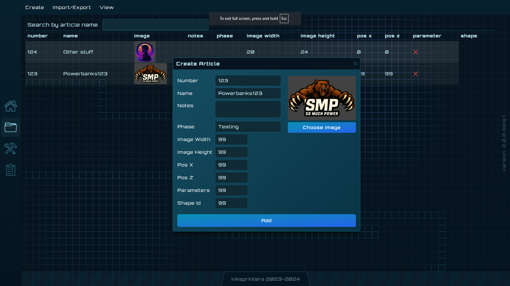
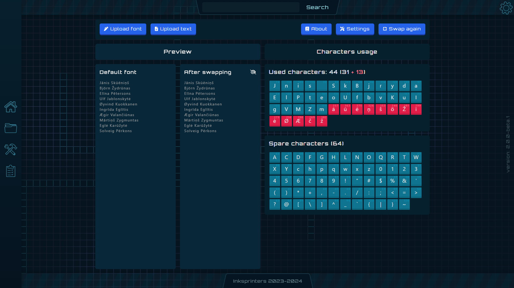
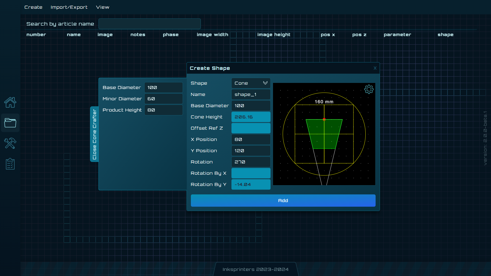

# 🌐 Web Practice Playground

This is a webpage I built to practice coding and to solve some real-world issues I’ve encountered at work. It started as an experimental playground and quickly turned into a small toolkit of useful, browser-based tools — no backend, no installs.

---

## 🖼️ Preview

---

## ⭐ Most Interesting Pages

### 🔸 Local CRUD with IndexedDB
Stores data directly in the browser using **IndexedDB**.  
You can **add, delete, edit, export**, and **import** entries as `.csv` — all fully offline.

---

### 🔸 ASCII-Proof Font Generator 🧙‍♂️
This one’s fun and weird.  
Because some legacy software **doesn’t specify file encoding** (often falling back to Windows-1252 or worse), text files with non-ASCII characters would break silently.

No one had access to the source code — so I made a workaround:
- The tool **scans the file for non-ASCII characters**
- Then it maps and swaps them with visually matching characters using a **custom font**
- It outputs:
  - A **clean ASCII-only text file**
  - A **custom font file** that visually restores the original characters

Result? 100% ASCII-safe file that won’t break in misconfigured apps ✨

---

### 🔸 Cone & Cylinder Renderer 🧱
For some reason, the software I work with didn’t support rendering basic 3D cone/cylinder shapes 🤷‍♂️  
So I built a simple WebGL-based renderer to fill the gap.

---

## 🧩 Stack
- Pure **HTML/CSS/JS**
- No frameworks, no dependencies
- Fully offline / client-side
- Can be deployed anywhere (or just opened locally)

---

Let me know if you want to try the hosted demo or run it locally!

> I have another repo where I had `php` `laravel` backend and frontend that was designed by my good friend in Adobe Illustrator. I removed all the apis and stuff, because most of the problems were with pdf files that were mostly custom each time - so I learnt Adoble Illustrator for that. :D
